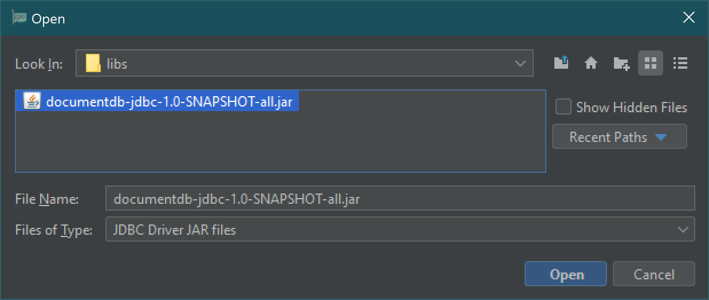

# Amazon DocumentDB JDBC Driver Setup

The DocumentDB JDBC driver can be setup for a number of business integration (BI) applications. 
Outlined here are the setup for [Tableau Desktop](https://www.tableau.com/products/desktop),
[DbVisualizer](https://www.dbvis.com/) and 
[SQirreL SQL Client](https://sourceforge.net/projects/squirrel-sql/).

## Topics

- [Getting Started](#getting-started)
    - [Prerequisites](#prerequisites)
    - [JRE or JDK Installation](#jre-or-jdk-installation)
    - [Adding Amazon RDS Certificate Authority Bundle](add-amazon-ca-certs.md) 
    - [Using an SSH Tunnel to Connect to Amazon DocumentDB](#using-an-ssh-tunnel-to-connect-to-amazon-documentdb)
    - [Download the DocumentDB JDBC Driver](#download-the-documentdb-jdbc-driver)
    
- [BI Tool Setup](#bi-tool-setup)
    - [Tableau Desktop](#tableau-desktop)
    - [DbVisualizer](#dbvisualizer)
    - [SQuirreL SQL Client](#squirrel-sql-client)

## Getting Started<a name='getting-started' />

### Prerequisites<a name='prerequisites' />

If you don't already have an Amazon DocumentDB cluster running on Amazon EC2, follow the 
instructions on how to [Connect with Amazon EC2](https://docs.aws.amazon.com/documentdb/latest/developerguide/connect-ec2.html).

### JRE or JDK Installation<a name='jre-or-jdk-installation' />

Depending on your BI application, you may need to ensure a 64-bit JRE or JDK installation version 8 
or later is installed on your computer. You can download the Java SE Runtime Environment 8 
[here](https://www.oracle.com/ca-en/java/technologies/javase-jre8-downloads.html).

### Using an SSH Tunnel to Connect to Amazon DocumentDB<a name='using-an-ssh-tunnel-to-connect-to-amazon-documentdb' />

If you are connecting to your Amazon DocumentDB cluster from outside its Amazon Virtual Private Cloud
(Amazon VPC), then you'll need to create an SSH tunnel to the Amazon DocumentDB cluster. Please
refer to [Using an SSH Tunnel to Connect to Amazon DocumentDB](ssh-tunnel.md).

### Download the DocumentDB JDBC Driver <a name='download-the-documentdb-jdbc-driver' />

<!-- >TODO: Get link for DocumentDB JDBC driver. -->
Download the DocumentDB JDBC driver here. The driver is packaged as a single JAR file 
(e.g., `documentdb-jdbc-1.0-SNAPSHOT-all.jar`).

## BI Tool Setup<a name='bi-tool-setup' />

### Tableau Desktop<a name='tableau-desktop' />

[Download](#download-the-documentdb-jdbc-driver) the DocumentDB JDBC driver JAR file and copy it to one of these
directories according to your operating system:

- **_Windows_**: `C:\Program Files\Tableau\Drivers`
- **_Mac_**: `~/Library/Tableau/Drivers`
- **_Linux_**: `/opt/tableau/tableau_driver/jdbc`

Download the DocumentDB Tableau connector (TACO file) and copy it to your `My Tableau Repository/Connectors`
directory. For more information, consult the [Tableau documentation](https://tableau.github.io/connector-plugin-sdk/docs/run-taco). 

#### Connecting to Amazon DocumentDB Using Tableau

1. Launch the Tableau Desktop application and navigate to 
   **Tableau > Connect > Amazon DocumentDB by Amazon DocumentDB**.
1. Enter the parameters. **Hostname**, **Port**, **Database**, **Username** and **Password** 
   are required while the others are optional. Descriptions for each parameter can be found in 
   the [JDBC connection string](connection-string.md) documentation. As an example, the image below 
   is equivalent to the connection string: 
   `jdbc:documentdb://localhost:27019/test?tls=true&tlsAllowInvalidHostnames=true&scanMethod=random&scanLimit=1000&loginTimeoutSec=0&readPreference=primary&retryReads=false` 
   with username and password passed separately in a properties file.
1. Click the **Sign In** button.

### DbVisualizer<a name='dbvisualizer' />

#### Adding the Amazon DocumentDB JDBC Driver

Start the DbVisualizer application and navigate to the menu path: **Tools > Driver Manager...** 

Click the plus icon (or menu path **Driver > Create Driver**)

1. For the **Name:** field, enter **DocumentDB**
1. For the **URL Format:** field, enter `jdbc:documentdb://<host>[:port]/<database>[?option=value[&option=value[...]]]`
1. Click the **folder** button on the right. Navigate to the location of your downloaded 
   Amazon DocumentDB JDBC driver JAR file. Select the file and click the **Open** button.
   
1. Ensure the `software.amazon.documentdb.jdbc.DocumentDbDriver` is selected in the **Driver Class:**
   field. Your Driver Manager settings for **DocumentDB** should look like the following image.
   
1. Close the dialog. The **DocumentDB** JDBC driver will be setup and ready to use.

#### Connecting to Amazon DocumentDB Using DbVisualizer

1. Navigate the menu path **Database > Create Database Connection**.
1. For the **Name** field, enter a descriptive name for the connection.
1. For the **Driver (JDBC)** field, choose the **DocumentDB** driver you created earlier.
1. For the **Database URL** field, enter your [JDBC connection string](connection-string.md). 
   For example, `jdbc:documentdb://localhost:27017/database?tlsAllowInvalidHostnames=true`
1. For the **Database Userid** field, enter your Amazon DocumentDB user ID.
1. For the **Database Password** field, enter the corresponding password for the user ID.
1. Your **Database Connection** dialog should look like the following.
   
1. Click the **Connect** button to make the connection to your Amazon DocumentDB database.

### SQuirreL SQL Client<a name='squirrel-sql-client' />

#### Adding the Amazon DocumentDB JDBC Driver

1. Launch the SQuirrel SQL Client application.
1. Ensure the **Drivers** tab is selected.
1. Navigate to menu path ***Drivers > New Driver ...***
1. For the **Name:** field, enter **DocumentDB**.
1. For the **Example URL:** field, enter `jdbc:documentdb://<host>[:port]/<database>[?option=value[&option=value[...]]]`
1. Select the **Extra Class Path** tab.
1. Click the **Add** button and navigate to the downloaded Amazon DocumentDB JDBC driver JAR file.
1. Click **OK** to add the JAR file to the **Extra Class Path**.
1. Click the **List Drivers** button.
1. For the **Class Name:** field, ensure the `software.amazon.documentdb.jdbc.DocumentDbDriver` 
   is selected.
   
1. Click the **OK** button to create and save the driver settings.

#### Connecting to Amazon DocumentDB Using SQuirreL SQL Client

1. Launch the SQuirrel SQL Client application.
1. Ensure the **Aliases** table is selected.
1. Navigate the menu path **Aliases > New Alias...**.
1. For the **Name:** field, enter a name for this alias.
1. For the **Driver:** field, ensure **DocumentDB** is selected.
1. For the **URLS:** field, enter your [JDBC connection string](connection-string.md).
   For example, `jdbc:documentdb://localhost:27017/database?tlsAllowInvalidHostnames=true`
1. For the **User Name:** field, enter your Amazon DocumentDB user ID.
1. For the **Password** field, enter the corresponding password for the user ID.
   
1. Click **OK** to save the alias.
1. Double-click your alias to start the connection dialog.
1. Click the **Connect** button to connect.
